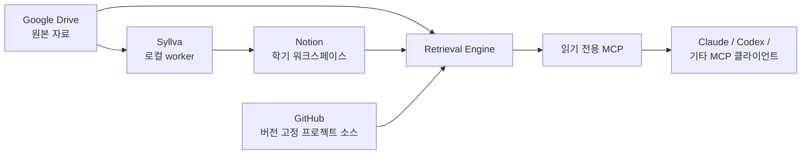

# Syllva

[English](README.md)

[](https://github.com/Just-Simple0/Syllva/actions/workflows/ci.yml)


> AI 학습 도우미를 위한 로컬 우선 학업 컨텍스트 시스템.

Syllva는 강의자료, 학업 워크스페이스, AI 클라이언트를 하나의 앱에 억지로 몰아넣지 않고 연결합니다. Google Drive에는 원본 자료를 두고, Notion은 사람이 사용하는 학업 워크스페이스를 제공하며, Syllva는 MCP를 통해 범위가 제한되고 출처를 추적할 수 있는 컨텍스트를 제공해 AI가 어떤 자료를 써야 할지 추측하지 않도록 합니다.

**로컬 우선 · 모델 비종속 · 출처 인식 · MCP 중심**

> [!WARNING]
> **Syllva 0.1.3은 베타 소프트웨어이며 아직 공개 패키지 릴리스가 아닙니다.** 현재 저장소는 소스 기반 설치와 검증을 전제로 하며, 일부 provider/client 경로는 사용자 환경에서 별도 검증이 필요합니다.

## Syllva가 해결하려는 것

Syllva의 핵심 원칙은 단순합니다. **어떤 컨텍스트가 허용되고 관련 있는지는 검색 시스템이 결정하고, AI 클라이언트는 전달받은 컨텍스트 위에서 추론합니다.**

현재 베타에서는 다음 학습 흐름을 구성할 수 있습니다.

- 과목, 수업, 자료, 시험, 활동, 사용자 컨텍스트 검색;
- 출처를 알 수 없는 대량 컨텍스트 대신 명시적 provenance와 source locator 제공;
- Google Drive 원본 자료와 결정적 정규화 산출물 관리;
- 과목, 수업, 할 일, 캘린더, 파일 접수를 위한 Notion 학기 워크스페이스;
- 사용자의 명시적 제출/취소 상태를 사용하는 제한된 파일 접수 처리;
- 지원되는 AI 클라이언트용 읽기 전용 MCP 도구;
- 선택적 LMS 동기화와 로컬 스케줄 실행;
- 자동화가 몰래 승격할 수 없는 사람 소유의 검증 필드.

## 전체 구조



- **Drive**: 원본 파일과 원본에서 파생된 산출물을 저장합니다.
- **Notion**: 학업 그래프, 사용자에게 보이는 상태, 사람의 검증을 저장합니다. 대용량 원문 본문을 canonical source로 삼지 않습니다.
- **GitHub**: 설정된 경우 정확한 ref의 프로젝트 소스를 제공합니다.
- **Retrieval Engine**: 범위, 권위, freshness, source selection, provenance를 소유합니다.
- **MCP**: 모델과 독립적인 읽기 경계입니다. 현재 베타의 검색 도구에서는 worker 쓰기 기능을 노출하지 않습니다.

## 일반적인 학습 흐름

1. Notion에서 학기 대시보드를 엽니다.
2. 과목으로 들어간 뒤 원하는 수업을 엽니다.
3. 새 자료가 있으면 설정된 학기 업로드 위치에 넣습니다.
4. 파일 접수 요청을 확인하고 명시적으로 제출합니다.
5. 연결된 AI 클라이언트에 개념 설명, 복습, 시험 준비, 근거 확인을 요청합니다.
6. 확인이 필요한 답변은 반환된 출처/provenance를 따라 검증합니다.

대시보드의 기본 순서는 **내 과목 → 이어서 공부 → To DO → 캘린더 → 파일 확인**입니다. 수업이 늘어나도 전역 메뉴가 늘어나지 않으며, 수업은 각 과목 안에서 관리합니다.

## 프로젝트 상태

| 영역 | 상태 |
| --- | --- |
| 패키지 | **0.1.3 beta**, 소스 설치, 미출시 |
| 코어 동작 프로토콜 | **1.2**, frozen protocol baseline |
| 코어 저장소 구현 | 구현 및 로컬 검증 완료 |
| 학기 파일 접수 | **Preview**, 구현됨; 실제 provider 설정 필요 |
| Notion 학기 워크스페이스 | 지원되는 워크플로우; 환경별 provisioning/readback 필요 |
| Claude local MCP | 실제 클라이언트 domain E2E 기록 전까지 **Experimental** |
| Codex local MCP | local stdio 설정 제공; 사용자 환경 검증 필요 |
| ChatGPT remote MCP/App | 계정 연결성과 인증 요구사항 검증 전까지 **Deployment deferred** |
| LMS sidecar | 선택 기능; credential/connection gate 통과 전 scheduler는 paused 유지 권장 |
| 실제 릴리스 검증 | 보류 / 환경 의존 |

패키지 버전과 프로토콜 버전은 의도적으로 독립적입니다. **0.1.3**은 베타 패키지 버전이고, **1.2**는 frozen core 동작/설계 프로토콜을 뜻합니다.

## 빠른 시작

요구사항: Python 3.11+ 및 로컬 checkout.

```bash
git clone https://github.com/Just-Simple0/Syllva.git
cd Syllva

python -m venv .venv
source .venv/bin/activate        # Windows: .venv\Scripts\activate
pip install -e '.[dev,mcp,drive,notion,pdf]'

uls init
uls doctor
uls behavior lint
```

`uls init`은 로컬 설정/상태만 만듭니다. Drive 감시, 파일 업로드, Notion 워크스페이스 생성, 자격증명 등록, scheduler 활성화를 자동으로 수행하지 않습니다. `uls doctor`는 아직 완료되지 않은 연결을 알려줍니다.

전체 과정은 [처음 시작하기](docs/user-guide/getting-started.ko.md)를 참고하세요. provider ID, 자격증명, worker, scheduler를 설정한다면 [운영자 가이드](docs/operator-guide/README.ko.md)를 사용하세요.

## 문서

- **[문서 홈](docs/README.ko.md)** — 사용자/운영자/개념/레퍼런스 경로 선택.
- **[사용자 가이드](docs/user-guide/README.ko.md)** — 대시보드, 일상 학습, 파일 접수, AI 사용, 문제 해결.
- **[운영자 가이드](docs/operator-guide/README.ko.md)** — 설치, provider 설정, intake, MCP client, LMS, scheduler, 백업/복구.
- **[개념](docs/concepts/README.ko.md)** — 아키텍처와 신뢰 모델.
- **[레퍼런스](docs/reference/README.ko.md)** — CLI, 상태, MCP 도구 표면.
- **[배포/운영](deployment/README.ko.md)** — 데스크톱/원격 운영 상세.
- **[클라이언트 패키징](clients/README.ko.md)** — 공통 행동 계약과 client projection.

`docs/plans/`, `docs/ux/`의 과거 설계·리뷰 자료는 초보자용 문서가 아니라 엔지니어링 증거로 보존합니다. 저장소 루트의 frozen protocol 문서는 v1.2 코어 동작의 권위 문서로 유지합니다.

## 신뢰 모델

Syllva는 **SOURCE**, **AI**, **USER** 소유 영역을 분리합니다.

- AI가 성공적으로 생성했다는 이유만으로 생성물이 source가 되지 않습니다.
- 사람만 바꿀 수 있는 verification/scope 필드는 write boundary에서 보호합니다.
- `Partial` 상태를 완전한 데이터처럼 조용히 보여주지 않습니다.
- 검색 capability는 제한된 범위와 현재 source 상태에 결속됩니다.
- 현재 프로토콜의 MCP 검색 표면은 읽기 전용입니다.
- 비밀값은 저장소 config, client instruction, prompt, log에 넣지 않는 것을 전제로 합니다.

일반 사용자를 위한 설명은 [신뢰 모델](docs/concepts/trust-model.ko.md), 규범적 상세는 frozen specification을 참고하세요.

## 저장소 구조

```text
contracts/        모델 비종속 학습 행동 계약
clients/          Claude / ChatGPT / MCP client projection
src/uls/          Python core, adapter, retrieval, intake, MCP, state
deployment/       데스크톱 scheduler와 remote-development profile
docs/             공개 가이드 + engineering plan/UX 기록
scripts/          packaging, lint, LMS, 운영 helper
tests/            unit, contract, integration, E2E scaffold
```

## 개발

```bash
python -m pytest -q
python scripts/lint_behavior_projection.py
python -m compileall -q src
```

현재 CI는 지원되는 Python 버전으로 macOS와 Windows를 검사합니다. 자동화 테스트는 저장소 동작을 검증하지만, 모든 외부 provider나 최종 AI client가 사용자의 실제 환경에서 연결되었다는 뜻은 아닙니다.

## 라이선스

Syllva는 [MIT License](LICENSE)로 배포됩니다.
