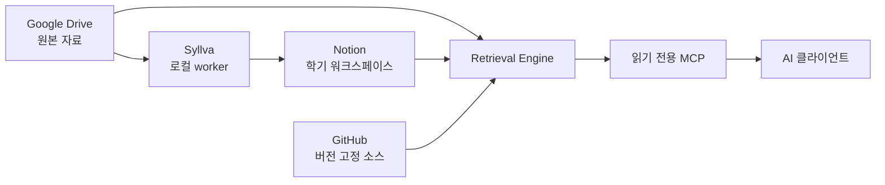

# Syllva

[English](README.md) · **[공식 문서](https://just-simple0.github.io/Syllva/ko/)**

[](https://github.com/Just-Simple0/Syllva/actions/workflows/ci.yml)


> AI 학습 흐름을 위한 로컬 우선, 출처 인식 학업 컨텍스트 시스템.

Syllva는 강의자료, Notion 학업 워크스페이스, 지원되는 AI 클라이언트를 하나의 앱에 억지로 몰아넣지 않고 연결합니다. Google Drive에는 원본 자료를 두고, Notion은 사람이 사용하는 워크스페이스를 제공하며, Syllva는 MCP를 통해 범위가 제한된 컨텍스트를 제공해 AI가 어떤 자료를 써야 할지 추측하지 않도록 합니다.

**로컬 우선 · 모델 비종속 · 출처 인식 · MCP 중심**

> [!WARNING]
> **Syllva 0.1.3은 베타 소프트웨어이며 아직 공개 패키지 릴리스가 아닙니다.** 현재는 소스 기반 설치를 통한 평가·개발을 전제로 하며, 일부 provider/client 경로는 사용자 환경에서 별도 검증이 필요합니다.

## 제공하는 기능

- 과목, 수업, 자료, 시험, 활동, 사용자 컨텍스트에 대한 출처/provenance 인식 검색;
- Google Drive 원본 자료와 결정적 정규화 산출물 관리;
- 과목, 수업, 할 일, 캘린더, 파일 접수를 위한 Notion 학기 워크스페이스;
- 지원되는 AI 클라이언트용 읽기 전용 MCP 검색 도구;
- 자동화가 조용히 승격할 수 없는 사람 소유의 검증 경계.

## 아키텍처



어떤 컨텍스트가 허용되고 관련 있는지는 검색 시스템이 결정하고, AI 클라이언트는 전달받은 컨텍스트 위에서 추론합니다.

## 빠른 시작

요구사항: Python 3.11+ 및 로컬 checkout.

```bash
git clone https://github.com/Just-Simple0/Syllva.git
cd Syllva

python -m venv .venv
source .venv/bin/activate        # Windows: .venv\Scripts\activate
pip install -e '.[dev,mcp,drive,notion,pdf]'

uls init
uls doctor
uls behavior lint
```

`uls init`은 로컬 설정/상태만 만듭니다. Drive 감시, Notion 워크스페이스 생성, 자격증명 등록, scheduler 활성화를 자동으로 수행하지 않습니다.

전체 설치와 사용 흐름은 **[공식 문서](https://just-simple0.github.io/Syllva/ko/)**에서 이어가면 됩니다.

## 프로젝트 상태

| 영역 | 상태 |
| --- | --- |
| 패키지 | **0.1.3 beta**, 미출시/소스 설치 |
| 코어 동작 프로토콜 | **1.2**, frozen baseline |
| 학기 파일 접수 | **Preview** |
| Claude local MCP | 실제 client E2E 기록 전까지 **Experimental** |
| ChatGPT remote MCP/App | 계정/인증 검증 전까지 **Deployment deferred** |
| LMS sidecar | 선택 기능; 검증 전 scheduler는 gated/paused |

패키지 버전과 프로토콜 버전은 의도적으로 독립적입니다. **0.1.3**은 베타 패키지 버전이고, **1.2**는 frozen core 동작/설계 프로토콜을 뜻합니다.

## 문서

주요 사용자 문서는 **[Syllva 공식 문서 사이트](https://just-simple0.github.io/Syllva/ko/)**에서 검색 가능한 한국어/영어 탐색 구조로 제공합니다.

- 사용자 가이드
- 운영자 가이드
- 개념
- 레퍼런스

Markdown 원본은 [`docs/`](docs/README.ko.md)에서 계속 버전 관리합니다. 과거 구현 계획과 UX 리뷰 기록은 [`docs/plans/`](docs/plans/), [`docs/ux/`](docs/ux/)에 초보자용 문서가 아닌 엔지니어링 증거로 보존합니다.

## 개발

```bash
python -m pytest -q
python scripts/lint_behavior_projection.py
python -m compileall -q src
```

문서 사이트 구현은 [`docs-site/`](docs-site/README.ko.md)에 있으며 Astro Starlight가 저장소의 Markdown 원본을 빌드 시 변환합니다.

## 라이선스

Syllva는 [MIT License](LICENSE)로 배포됩니다.
