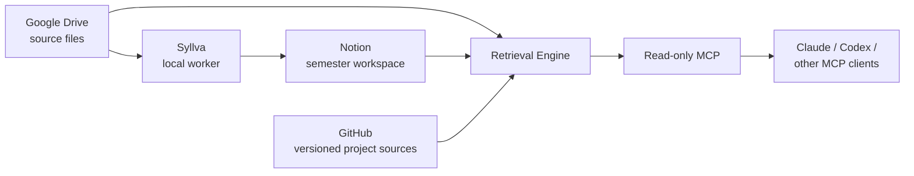

# Syllva

[한국어](README.ko.md)

[](https://github.com/Just-Simple0/Syllva/actions/workflows/ci.yml)


> A local-first academic context system for AI study assistants.

Syllva connects course materials, an academic workspace, and AI clients without forcing study data into one application. Google Drive keeps source files, Notion provides the human-facing academic workspace, and Syllva retrieves bounded, source-aware context through MCP so an AI client can reason over the right material instead of guessing what it should use.

**Local-first · Model-agnostic · Source-aware · MCP-centered**

> [!WARNING]
> **Syllva 0.1.3 is beta software and is not published as a public package release.** The repository is intended for source-based installation and evaluation. Some provider/client paths still require environment-specific validation.

## What Syllva is for

Syllva is designed around a simple idea: **the retrieval system decides what context is allowed and relevant; the AI client reasons over the context it receives.**

With the current beta you can build a study workflow around:

- course, session, material, exam, activity, and user-context retrieval;
- explicit provenance and source locators instead of untraceable context dumps;
- Google Drive source material plus deterministic normalized derivatives;
- a Notion-based semester workspace for courses, sessions, tasks, calendar items, and file intake;
- bounded file-intake processing with explicit user submission/cancellation states;
- read-only MCP tools for supported AI clients;
- optional LMS synchronization and local scheduled operation;
- human-owned verification fields that automation is not allowed to silently promote.

## How it fits together



- **Drive** stores canonical source files and source-derived artifacts.
- **Notion** stores the academic graph, user-visible state, and human verification—not canonical large text bodies.
- **GitHub** can provide exact-ref project sources when configured.
- **Retrieval Engine** owns scope, authority, freshness, selection, and provenance.
- **MCP** is the model-neutral read boundary. In the current beta, retrieval tools do not expose worker mutations.

## Typical study flow

1. Open the semester dashboard in Notion.
2. Enter a course, then a session.
3. Put new material in the configured semester upload location when needed.
4. Confirm the file-intake request and submit it explicitly.
5. Ask a connected AI client to explain, review, prepare for an exam, or verify a claim.
6. Follow the returned source/provenance information when the answer needs checking.

The intended dashboard order is **Courses → Continue studying → To DO → Calendar → Files**. Session count does not expand the global navigation; sessions live under their course.

## Project status

| Area | Status |
| --- | --- |
| Package | **0.1.3 beta**, source install, unpublished |
| Core behavior protocol | **1.2**, frozen protocol baseline |
| Core repository implementation | Implemented and locally validated |
| Semester intake lane | **Preview**, implemented; real provider setup required |
| Notion semester workspace | Supported workflow; environment-specific provisioning/readback required |
| Claude local MCP | **Experimental** until real-client domain E2E is recorded |
| Codex local MCP | Local stdio configuration available; environment validation required |
| ChatGPT remote MCP/App | **Deployment deferred** until account connectivity/auth requirements are validated |
| LMS sidecar | Optional; scheduler is expected to remain paused until credential/connection gates pass |
| Live release validation | Deferred / environment-dependent |

Package versioning and protocol versioning are intentionally independent: **0.1.3** is the beta package version, while **1.2** names the frozen core behavior/design protocol.

## Quick start

Requirements: Python 3.11+ and a local checkout.

```bash
git clone https://github.com/Just-Simple0/Syllva.git
cd Syllva

python -m venv .venv
source .venv/bin/activate        # Windows: .venv\Scripts\activate
pip install -e '.[dev,mcp,drive,notion,pdf]'

uls init
uls doctor
uls behavior lint
```

`uls init` creates local configuration/state only. It does **not** watch Drive, upload files, create a Notion workspace, enroll credentials, or turn on a scheduler. `uls doctor` reports which connections are still incomplete.

For the complete path, continue with the [Getting Started guide](docs/user-guide/getting-started.md). If you are configuring provider IDs, credentials, workers, or schedulers, use the [Operator Guide](docs/operator-guide/README.md).

## Documentation

- **[Documentation home](docs/README.md)** — choose a user, operator, concept, or reference path.
- **[User Guide](docs/user-guide/README.md)** — dashboard, daily study flow, file intake, AI use, and troubleshooting.
- **[Operator Guide](docs/operator-guide/README.md)** — installation, provider configuration, intake, MCP clients, LMS, scheduling, backup/recovery.
- **[Concepts](docs/concepts/README.md)** — architecture and trust model.
- **[Reference](docs/reference/README.md)** — CLI, statuses, and MCP tool surface.
- **[Deployment notes](deployment/README.md)** — desktop/remote operation details.
- **[Client packaging](clients/README.md)** — shared behavior contract and client projections.

Historical design/review material under `docs/plans/` and `docs/ux/` is kept as engineering evidence rather than beginner documentation. The frozen protocol documents at the repository root remain authoritative for v1.2 core behavior.

## Trust model

Syllva separates **SOURCE**, **AI**, and **USER** ownership zones. Important safety properties include:

- AI-generated text does not become a source merely because it was generated successfully.
- Human-only fields such as verification/scope confirmation are guarded at the write boundary.
- `Partial` data is not silently presented as complete.
- retrieval capabilities are bounded and tied to current source state;
- MCP retrieval is read-only in the current protocol surface;
- secrets are not intended to live in repository config, client instructions, prompts, or logs.

See [Trust Model](docs/concepts/trust-model.md) for the user-facing explanation and the frozen specifications for normative detail.

## Repository layout

```text
contracts/        model-neutral study behavior contract
clients/          Claude / ChatGPT / MCP client projections
src/uls/          Python core, adapters, retrieval, intake, MCP, state
deployment/       desktop scheduler and remote-development profiles
docs/             public guides plus engineering plans/UX records
scripts/          packaging, linting, LMS and operational helpers
tests/            unit, contract, integration and E2E scaffolding
```

## Development

```bash
python -m pytest -q
python scripts/lint_behavior_projection.py
python -m compileall -q src
```

CI currently exercises macOS and Windows with supported Python versions. Automated tests validate repository behavior; they do not by themselves prove that every external provider or end-user AI client is live in your environment.

## License

Syllva is licensed under the [MIT License](LICENSE).
