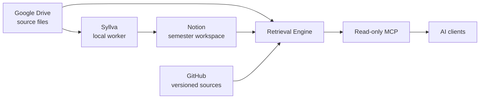

# Syllva

[한국어](README.ko.md) · **[Official Documentation](https://just-simple0.github.io/Syllva/)**

[](https://github.com/Just-Simple0/Syllva/actions/workflows/ci.yml)


> A local-first, source-aware academic context system for AI study workflows.

Syllva connects course materials, a Notion academic workspace, and supported AI clients without forcing study data into one application. Google Drive keeps source files, Notion provides the human-facing workspace, and Syllva retrieves bounded context through MCP so AI clients can work from the right material instead of guessing what they should use.

**Local-first · Model-agnostic · Source-aware · MCP-centered**

> [!WARNING]
> **Syllva 0.1.3 is beta software and is not published as a public package release.** Source-based installation is intended for evaluation and development. Some provider/client paths still require environment-specific validation.

## What it provides

- source/provenance-aware retrieval for courses, sessions, materials, exams, activities, and user context;
- Google Drive source storage plus deterministic normalized derivatives;
- a Notion semester workspace for courses, sessions, tasks, calendar items, and file intake;
- read-only MCP retrieval tools for supported AI clients;
- human-owned verification boundaries that automation cannot silently promote.

## Architecture



The retrieval system decides what context is allowed and relevant; the AI client reasons over the context it receives.

## Quick start

Requirements: Python 3.11+ and a local checkout.

```bash
git clone https://github.com/Just-Simple0/Syllva.git
cd Syllva

python -m venv .venv
source .venv/bin/activate        # Windows: .venv\Scripts\activate
pip install -e '.[dev,mcp,drive,notion,pdf]'

uls init
uls doctor
uls behavior lint
```

`uls init` creates local configuration/state only. It does not automatically watch Drive, create a Notion workspace, enroll credentials, or enable a scheduler.

Continue with the **[official documentation](https://just-simple0.github.io/Syllva/)** for the complete setup and usage flow.

## Project status

| Area | Status |
| --- | --- |
| Package | **0.1.3 beta**, unpublished/source install |
| Core behavior protocol | **1.2**, frozen baseline |
| Semester intake | **Preview** |
| Claude local MCP | **Experimental** until real-client E2E is recorded |
| ChatGPT remote MCP/App | **Deployment deferred** until account/auth validation |
| LMS sidecar | Optional; scheduler remains gated/paused until validated |

Package versioning and protocol versioning are intentionally independent: **0.1.3** is the beta package version, while **1.2** identifies the frozen core behavior/design protocol.

## Documentation

The primary reader experience is the **[Syllva Docs site](https://just-simple0.github.io/Syllva/)**, which provides searchable English/Korean navigation for:

- User Guide
- Operator Guide
- Concepts
- Reference

The Markdown sources remain version-controlled under [`docs/`](docs/README.md). Historical implementation plans and UX review records remain in [`docs/plans/`](docs/plans/) and [`docs/ux/`](docs/ux/) as engineering evidence rather than beginner documentation.

## Development

```bash
python -m pytest -q
python scripts/lint_behavior_projection.py
python -m compileall -q src
```

The documentation site lives in [`docs-site/`](docs-site/README.md) and is built with Astro Starlight from the repository Markdown sources.

## License

Syllva is licensed under the [MIT License](LICENSE).
