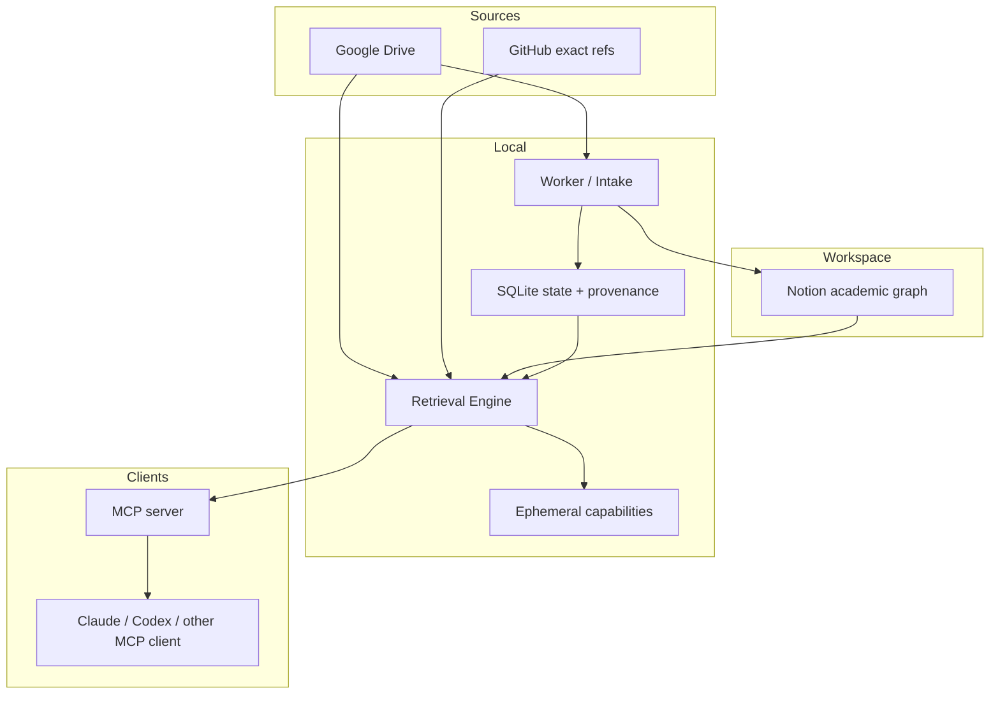

# 아키텍처

[English](architecture.md) · [개념](README.ko.md)

Syllva는 데이터 소유, orchestration, retrieval, client 계층을 의도적으로 분리합니다.

## Drive: 원본 저장소

Drive는 원본 source file과 source-derived artifact를 보관합니다. 파일명만으로 과목/수업 identity를 임의로 만들 만큼 충분한 권위로 보지 않습니다.

## Notion: 학업 그래프와 사람의 상태

Notion은 사람이 사용하는 workspace입니다. 관계, 보이는 workflow state, 일정, 사용자 메모, human verification field를 저장합니다. 대용량 canonical source 본문은 Notion 밖에 유지합니다.

## SQLite: orchestration memory

로컬 durable state에는 job, source version, provenance, attempt, recovery 정보가 기록됩니다. worker가 완료된 작업과 불확실/재시도 가능한 작업을 구분하는 데 사용합니다.

## Retrieval Engine: 정책 경계

Retrieval Engine은 scope, authority, freshness, candidate selection, provenance를 소유합니다. client prompt/skill이 engine이 허용하지 않은 접근 권한을 스스로 만들 수 없습니다.

## Ephemeral capability

일부 후속 retrieval은 짧게 살아 있는 in-memory capability로 표현합니다. 제한된 scope와 source 상태에 결속되며 restart/source change로 무효화될 수 있습니다.

## MCP: client-neutral read surface

MCP는 ingestion worker를 AI가 제어하는 write tool로 노출하지 않고 retrieval tool만 제공합니다. 서로 다른 client가 동일한 server-side access rule을 사용할 수 있습니다.

## Local-first의 의미

orchestration/state와 provider credential에 대한 제어점을 사용자 로컬 Syllva process에 둡니다. 외부 storage/workspace provider는 명시적으로 연결할 수 있습니다. “local-first”는 “네트워크가 전혀 없음”이 아니라 opaque hosted agent가 workflow 전체를 조용히 소유하지 않는다는 뜻입니다.
