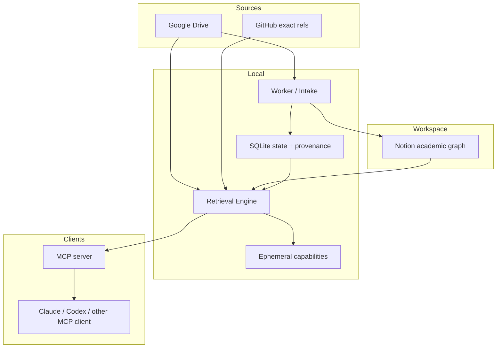

# Architecture

[한국어](architecture.ko.md) · [Concepts](README.md)

Syllva is intentionally split into data ownership, orchestration, retrieval, and client layers.

## Drive: source storage

Drive holds original source files and source-derived artifacts. A filename is not treated as enough authority to invent course/session identity.

## Notion: academic graph and human state

Notion is the human-facing workspace. It stores relationships, visible workflow state, schedules, user notes, and human verification fields. Large canonical source bodies remain outside Notion.

## SQLite: orchestration memory

Local durable state records jobs, source versions, provenance, attempts, and recovery information. It helps the worker distinguish completed work from uncertain or retryable work.

## Retrieval Engine: policy boundary

The Retrieval Engine owns scope, authority, freshness, candidate selection, and provenance. Client prompts/skills cannot grant themselves access that the engine did not authorize.

## Ephemeral capabilities

Some follow-up retrieval is represented by short-lived in-memory capabilities. They are bounded to a scope and source state, and restart/source change can invalidate them.

## MCP: client-neutral read surface

MCP exposes retrieval tools without exposing the ingestion worker as an AI-controlled write tool. Different clients can share the same server-side access rules.

## Why local-first

The architecture keeps orchestration/state and provider credentials under the user's control while allowing external storage/workspace providers to be used explicitly. “Local-first” does not mean “no network”; it means the local Syllva process remains the control point rather than an opaque hosted agent silently owning the workflow.
